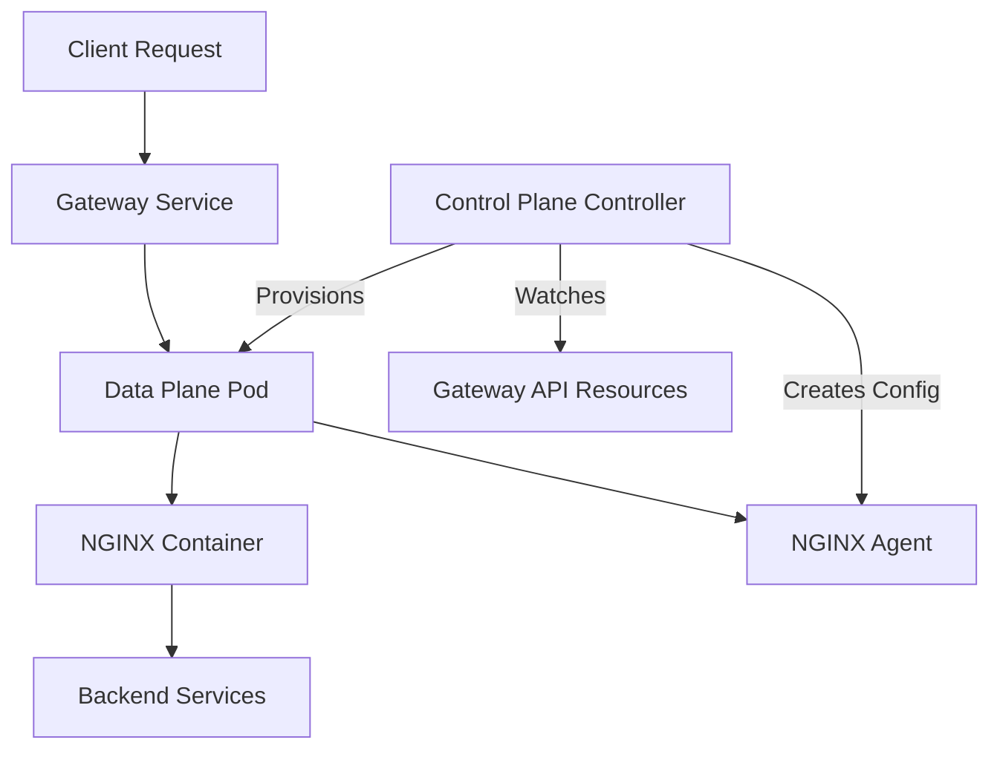

# Getting started with use cases

1. Clone this repository

```code
git clone https://github.com/tareqaminul/f5-nginx-redhat-ocp-ph26.git
```

2. Change directory

```code
cd f5-nginx-redhat-ocp-ph26/Part-2-Nginx-Gateway-Fabric
```

## Running use cases

- [Lab 1](1.basic-app) - Basic URI-based routing
- [Lab 2](2.advanced-routing) - Advanced routing using HTTP matching conditions
- [Lab 3](3.http-headers) - Modify HTTP request and response headers
- [Lab 4](4.tls-offload) - TLS offload
- [Lab 5](5.traffic-splitting) - Traffic splitting
- [Lab 6](6.grpc) - gRPC support
- [Lab 7](7.auth-jwt) - JWT authentication
- [Lab 8](8.rate-limit) - Rate limiting
- [Lab 9](9.waf) - F5 WAF for NGINX

The official NGINX Gateway Fabric repository provides additional [examples](https://github.com/nginx/nginx-gateway-fabric/tree/main/examples)

# NGF Bascis

### The Gateway API: A Paradigm Shift in Kubernetes Traffic Management

Kubernetes has become the foundation for cloud-native applications, but managing and routing traffic within clusters remains challenging. The traditional Ingress resource, while helpful for exposing services, has shown significant limitations:

- **Loosely defined specifications** leading to controller-specific behaviors
- **Annotation overload** making configurations complex and unportable
- **Limited support** for advanced deployment patterns (canary, blue-green releases)
- **Vendor lock-in** through proprietary extensions and features

### Enter the Gateway API

The Kubernetes Gateway API is a new, standards-based approach to service networking that addresses these limitations by providing:

- **Greater flexibility** with role-oriented design
- **Comprehensive feature set** for modern traffic management
- **Built-in support** for TLS offloading, traffic splitting, and service mesh integration
- **Clear separation** between platform engineers, developers, and security teams

> **💡 Key Concept**: Just like Ingress controllers, the Gateway API separates concerns:
> 
> - **Gateway API Resources**: Define routing rules (Gateway, HTTPRoute, etc.)
> - **Gateway API Controller**: Handles actual traffic routing (not built into Kubernetes)
> 
> You must install a Gateway API controller implementation, such as NGINX Gateway Fabric, to process these resources.

---

## NGINX Gateway Fabric - F5 NGINX Implementaion of Gateway API
NGINX Gateway Fabric provides an implementation of the Gateway API using NGINX as the data plane. The goal of the project is to implement the core Gateway APIs needed to configure an HTTP or TCP/UDP load balancer, reverse proxy, or API gateway for Kubernetes applications.

Built on the Gateway API standard, NGINX Gateway Fabric offers a production-ready solution. It combines the robustness and performance of NGINX with the extensibility of this new standard. It provides consistent traffic management, observability, and security across Kubernetes clusters. Additionally, its integration with NGINX One Console enables centralized control and monitoring in distributed environments.

For a list of supported Gateway API resources and features, see the [Gateway API Compatibility](https://docs.nginx.com/nginx-gateway-fabric/overview/gateway-api-compatibility/) documentation.
---


## Architecture

### NGINX Gateway Fabric Overview

[NGINX Gateway Fabric](https://github.com/nginx/nginx-gateway-fabric) is F5 NGINX's production-ready implementation of the Gateway API standard. It leverages NGINX as the data plane to provide:

- High-performance HTTP and TCP/UDP load balancing
- Reverse proxy and API gateway capabilities
- Centralized management via NGINX One Console
- Full observability and security features

For a complete list of supported resources and features, see the [Gateway API Compatibility](https://docs.nginx.com/nginx-gateway-fabric/overview/gateway-api-compatibility/) documentation.

### Design

NGINX Gateway Fabric uses a split-plane architecture with two controller types:

#### Control Plane Controller
- Deployed when you install NGINX Gateway Fabric
- Watches Gateway API custom resources (Gateway, HTTPRoute, TLSRoute, etc.)
- Translates Gateway API resources into NGINX configurations
- Manages the lifecycle of data plane deployments

#### Data Plane Controller
- Dynamically created when a Gateway resource is provisioned
- Consists of NGINX container with NGINX Agent
- Handles actual traffic routing to services
- Each Gateway gets its own isolated data plane deployment


**NGF Workflow:**

1. Control plane watches Kubernetes API for Gateway resources
2. When a Gateway is created, control plane provisions a new data plane deployment
3. Control plane generates NGINX configuration and pushes to NGINX Agent
4. Data plane routes traffic according to HTTPRoute and other routing rules

Learn more: [Gateway Architecture Documentation](https://docs.nginx.com/nginx-gateway-fabric/overview/gateway-architecture/)
---


# NGF for OpenShift

## CRDs


## What `NginxGatewayFabric` is

It's the **operator's umbrella CR** — the single object you create and edit, which the Helm-based operator expands into a full NGF installation. The NGINX Gateway Fabric Operator deploys and manages one or more NGINX Gateway Fabric control planes, which in turn handle the NGINX/NGINX Plus deployments. Each `NginxGatewayFabric` you create = one complete NGF install (one control plane + its config).

Crucially, it **owns and generates** the other two CRDs. You saw this directly in the NginxProxy YAML dump the other day — its `ownerReferences` pointed back at `kind: NginxGatewayFabric`. So the hierarchy is:

```
NginxGatewayFabric              ← you edit THIS (operator/Helm-values layer)
  └─ owns & generates ─┐
       ├─ NginxGateway       → control plane config (logging level)
       └─ NginxProxy         → data plane config (Service, Deployment, NGINX settings)
```

Editing `NginxGateway`/`NginxProxy` directly gets reconciled away — they're outputs, not inputs. The operator CR's `spec.nginxGateway.*` feeds the NginxGateway; its `spec.nginx.*` feeds the NginxProxy.


## NginxGatewayFabric vs NginxGateway vs NginxProxy

| | **NginxGatewayFabric** | NginxGateway | NginxProxy |
|---|---|---|---|
| Role | Operator umbrella / install CR | Control plane config | Data plane config |
| You edit it? | **Yes — this is the input** | No (generated) | No (generated) |
| Group/Version | `gateway.nginx.org/v1alpha1` | `gateway.nginx.org` (confirm) | `gateway.nginx.org/v1alpha2` |
| Owns | NginxGateway + NginxProxy | — | — |
| Typical contents | `spec.nginxGateway.*`, `spec.nginx.*`, `plus`, image, replicas | `logging.level` | `kubernetes.*`, `ipFamily`, `disableHTTP2`, metrics, telemetry |
| Wired up by | OLM / the operator | controller `--nginx-gateway-config-name` | GatewayClass `parametersRef` or a Gateway |
| Count in your cluster | **2** (nginx-gateway, crapi) | 1 per fabric instance | 1 per fabric instance |

`NginxGatewayFabric` is the dial you turn; `NginxGateway` and `NginxProxy` are the readouts it drives, one per plane.

## USE this before cURL
```sh
export NGF_IP=$(oc get nodes -o jsonpath='{.items[0].status.addresses[?(@.type=="InternalIP")].address}' | awk '{print $1}')
export HTTP_PORT=`oc get svc gateway-nginx -o jsonpath='{.spec.ports[0].nodePort}'`
```
